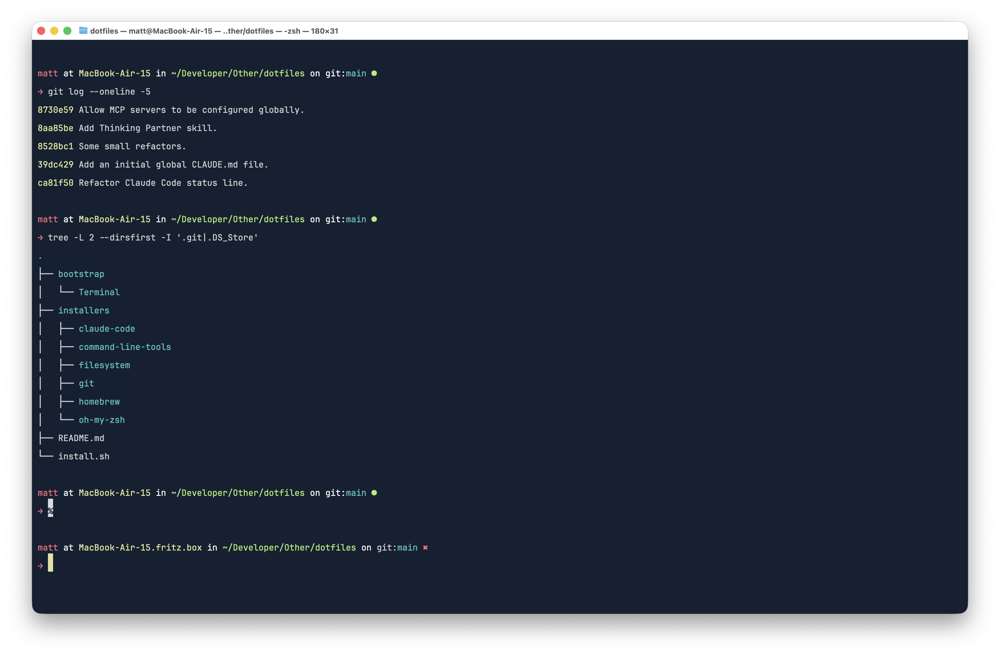
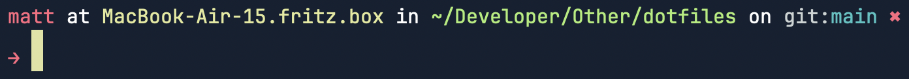
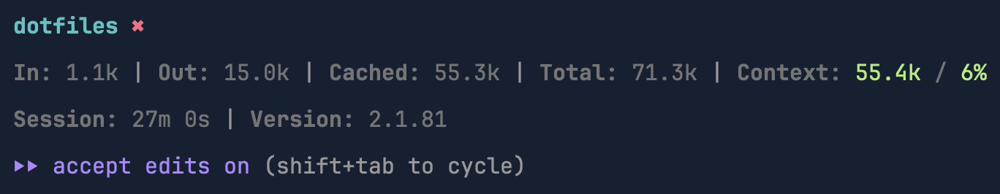

# Dotfiles
Because `~` is where the ❤️ is.

A single command to go from a fresh Mac to a fully configured development machine - with modular app bundles, an opinionated shell, and a complete [Claude Code](https://docs.anthropic.com/en/docs/claude-code) setup including a custom statusline and skills.

<!-- screenshot: Terminal with the Lick prompt in one of the bundled themes -->


---

## Highlights
- **One command install** - interactive, idempotent, and safe to re-run
- **Modular Brewfiles** - pick only what you need: dev tools, audio production, video editing, electronics, 3D printing, or games
- **Custom ZSH theme** - the [Lick](#lick-theme) prompt with git status at a glance
- **Claude Code configuration** - settings, a [custom statusline](#statusline), [MCP servers](#mcp-servers) with secret management, and skills.
- **Three Terminal themes** - Carbon, Palenight, and Tokyo Night. Choose your favourite.
- **Hardware-aware** - optional installs for Elgato, Logitech, and Røde gear

---

## What's Inside
```
dotfiles/
├── install.sh                      # Entry point - runs everything below
├── bootstrap/
│   └── Terminal/                    # macOS Terminal.app themes
│       ├── Carbon.terminal
│       ├── Palenight.terminal
│       └── Tokyo Night.terminal
├── installers/
│   ├── command-line-tools/          # Validates Xcode Command Line Tools
│   ├── filesystem/                  # Creates ~/* directories
│   ├── git/                         # .gitconfig + global .gitignore
│   ├── oh-my-zsh/                   # Shell config, theme & aliases
│   │   └── data/custom/
│   │       ├── git.zsh              # Git aliases
│   │       ├── homebrew.zsh         # Homebrew shell setup
│   │       ├── laravel.zsh          # Laravel aliases
│   │       ├── path.zsh             # PATH setup
│   │       └── themes/
│   │           └── lick.zsh-theme   # Custom prompt
│   ├── homebrew/                    # Modular Brewfile system
│   │   └── data/
│   │       ├── Brewfile.core
│   │       ├── Brewfile.development
│   │       ├── Brewfile.audio
│   │       ├── Brewfile.video
│   │       ├── Brewfile.electronics
│   │       ├── Brewfile.3dprinting
│   │       └── Brewfile.games
│   └── claude-code/                 # Claude Code config & skills
│       └── data/global/
│           ├── CLAUDE.md
│           ├── settings.json
│           ├── statusline.sh
│           ├── mcp.json
│           └── skills/
│               └── <various skills>
```

---

## Quick Start
```bash
git clone https://github.com/your-username/dotfiles.git ~/Developer/Other/dotfiles
cd ~/Developer/Other/dotfiles
./install.sh
```

The installer walks you through each step interactively. Nothing runs without your say-so - every major section asks before proceeding. It's safe to run multiple times; it checks for existing installations and won't re-install things that are already there.

The installer will:

1. Verify Xcode Command Line Tools are present
2. Create the filesystem directory structures
3. Configure Git
4. Install and configure Oh My ZSH!
5. Bootstrap apps via Homebrew (you choose which modules)
6. Configure Claude Code (settings, statusline, skills, MCP servers)

---

## Modules
The Homebrew step uses a modular Brewfile system. The core module always installs; the rest are opt-in.

### Core
Installed on every machine.

| Type | Apps |
|------|------|
| Communication | ChatGPT, Discord, Slack, Telegram, Zoom |
| Productivity | Dropbox, Google Chrome, Rocket |
| Office | Keynote, Numbers, Pages |

### Development
| Type | Apps |
|------|------|
| Editor & IDE | Claude Code, VS Code, PHPStorm |
| Fonts | JetBrains Mono |
| CLI | jq, uv |
| Database | TablePlus |
| Design | Figma, SF Symbols |
| PHP | Herd, Tinkerwell |
| Other | Godot, Xcode |

### Audio
| Type | Apps |
|------|------|
| CLI | FFmpeg, SOX, yt-dlp |
| DAW | Logic Pro, MainStage |
| Plugins | iK Product Manager |
| Live | QLab |

### Video
| Type | Apps |
|------|------|
| Editor | Final Cut Pro |

### Electronics
| Type | Apps |
|------|------|
| PCB Design | KiCad |
| Microcontrollers | Arduino IDE |

### 3D Printing
| Type | Apps |
|------|------|
| CAD | Autodesk Fusion |
| Slicer | Bambu Studio |

### Games
| Type | Apps |
|------|------|
| Games | Minecraft |

### Hardware
Optional per-device installs, prompted individually:

- **Logi Options+** - Logitech peripherals
- **Stream Deck** - Elgato Stream Deck
- **Elgato Control Center** - Elgato lights & accessories
- **Røde Central** - Røde audio interfaces & microphones

---

## Shell

### Lick Theme
A clean, informative ZSH prompt:

```
matt at MacBook in ~/Developer/Other/dotfiles on git:main ●
→
```

Shows your username, machine name, current directory, and git branch with a dirty/clean indicator (red ✖︎ / green ●). Supports custom machine names via `~/.machine-name`.

<!-- screenshot: The Lick prompt in action -->


### Git Aliases
```bash
nah     # Discard all uncommitted changes and untracked files
prune   # Remove local references to deleted remote branches
wip     # Quick work-in-progress commit of all changes
```

### Laravel Aliases
```bash
pa      # php artisan
tinker  # php artisan tinker
llog    # Tail the Laravel log with highlighted timestamps and exceptions
```

### PATH
Sets up PATH for Homebrew, Composer, Node, local binaries (`~/.local/bin`), and project-local `vendor/bin` and `node_modules/.bin` - so project tools always take priority.

---

## Git Configuration
An opinionated `.gitconfig` with sensible defaults:

- **Aliases** - `br`, `co`, `st` for branch, checkout, status
- **Whitespace** - aggressive detection and auto-fix on apply
- **Branches** - sorted by most recently committed
- **Diff** - detects copies as well as renames
- **Fetch** - auto-prunes deleted remote branches
- **Push** - auto-follows annotated tags
- **Help** - prompts to correct mistyped commands
- **Performance** - untracked file caching, safe rebase on macOS

The global `.gitignore` covers macOS system files (`.DS_Store`, `.AppleDouble`), IDE files (`.idea`), environment files (`.env`), and Claude Code local settings.

---

## Claude Code
This repo ships a full Claude Code configuration - not just settings, but a custom statusline, skills, and MCP server management with interactive secret injection.

### Statusline
A custom statusline that replaces the default Claude Code status bar with a live dashboard:

```
dotfiles ●
In: 45.2k | Out: 3.1k | Cached: 12.8k | Total: 61.1k | Context: 58.0k / 23%
Session: 4m 12s | Version: 1.0.0
```

Shows repository name with git dirty/clean status, token usage with SI notation, context window usage with colour-coded warnings (green → yellow → red as you approach limits), session duration, and Claude version.

<!-- screenshot: The statusline in Claude Code -->


### Skills
Ships with custom skills in `~/.claude/skills/` that extend Claude's capabilities. Add your own by dropping `.md` files into the skills directory.

### MCP Servers
The installer manages MCP server configuration with a clever secret injection system. Server definitions live in `mcp.json` with `${PLACEHOLDER}` values for secrets. During installation, the script:

1. Detects which environment variables need values
2. Checks if they're already set in `~/.claude.json`
3. Prompts for missing values (with masked input)
4. Merges the configuration non-destructively using `jq`

Add your own servers by editing `mcp.json`.

---

## Terminal Themes
Three themes for macOS Terminal.app, bundled in `bootstrap/Terminal/`:

| Theme | Description |
|-------|-------------|
| Carbon | Dark with warm tones |
| Palenight | Material Design inspired |
| Tokyo Night | Cool blue palette |

Import them via Terminal → Settings → Profiles → Import.

---

## Filesystem
The installer creates a tidy project structure:

```
~/Developer/
├── Apps/
├── Games/
├── Packages/
├── Sites/
└── Other/
```

---

## Contributing
This is a personal configuration, but if you spot something useful and want to adapt it - go for it. Fork it, strip out the bits you don't need, and make it yours.

## License
MIT
